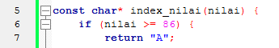
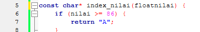
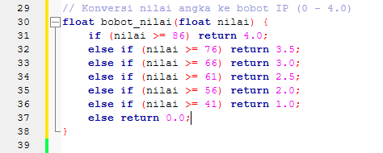
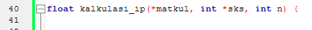
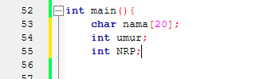

# HALO REK
Report Perbaikan DASPROG P1

# Deklarasi
ini bahasa C gaada deklarasinya gimana wee
Before :

After :

# Fungsi
trus ini kenapa ga lengkap gitu woilah
Before :

After : 

Before : 

After : 

