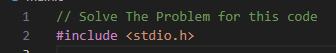
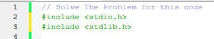
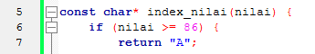
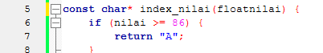
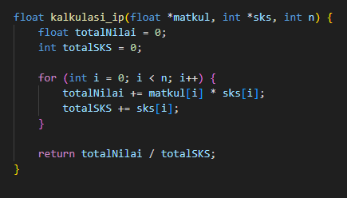
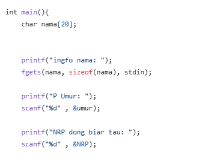
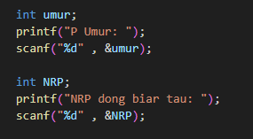
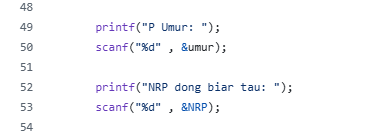
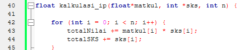
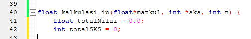

# HALO REK
Report Perbaikan DASPROG P1

# Library
Melengkapi Deklarasi yang hilang
Before :

After :

# Update
Menambahkan sejumlah deklarasi yang hilang

Before :

After : 

Before : 

After : 

Before :

After : 

Before :

After :

Merubah tipe data integer pada NRP menggunakan char
int NRP; --> char NRP[30];

scanf("NRP \s",NRP);

printf("NRP \s",NRP);
